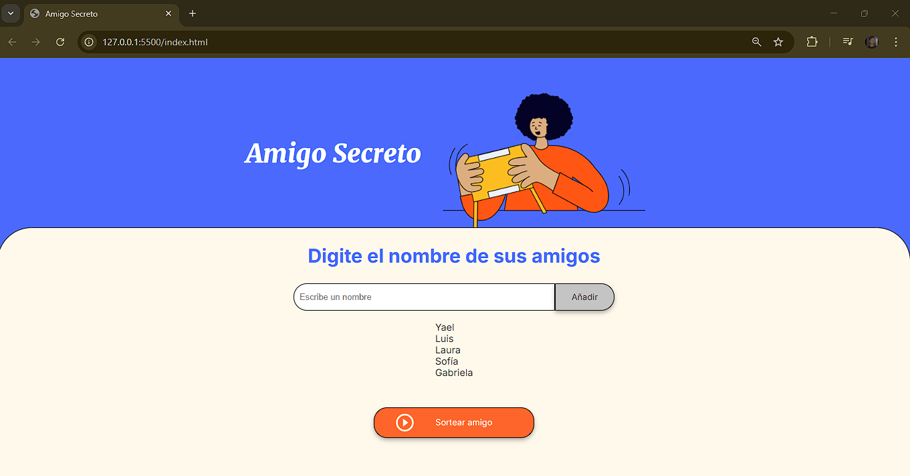

# Amigo Secreto

Este proyecto es una aplicación web simple desarrollada como parte del curso "Principiante de Programación" de Alura Latam. La aplicación permite a los usuarios agregar un número ilimitado de nombres de amigos y realizar un sorteo aleatorio para asignar un "amigo secreto".

## Descripción

La aplicación cuenta con dos funcionalidades principales:

- **Agregar amigos:** El usuario puede ingresar el nombre de un amigo y hacer clic en el botón "Añadir" para agregarlo a una lista.
- **Sortear amigo:** Una vez ingresados los nombres, el usuario puede presionar el botón "Sortear amigo" para elegir de manera aleatoria a uno de los amigos de la lista. El resultado se mostrará en la pantalla con el mensaje "El amigo sorteado es: [nombre]".

## Tecnologías utilizadas

- HTML5
- CSS3
- JavaScript

## Archivos del proyecto

- **index.html:** Estructura principal de la aplicación.
- **style.css:** Estilos y diseño de la aplicación.
- **app.js:** Lógica de JavaScript para agregar amigos y realizar el sorteo.

## Instrucciones de uso

1. **Clonar el repositorio:**

   ```bash
   [git clone https://github.com/tu-usuario/amigo-secreto.git](https://github.com/Malvadoyael/Challenge_Alura.git)


## Imagenes del proyecto





